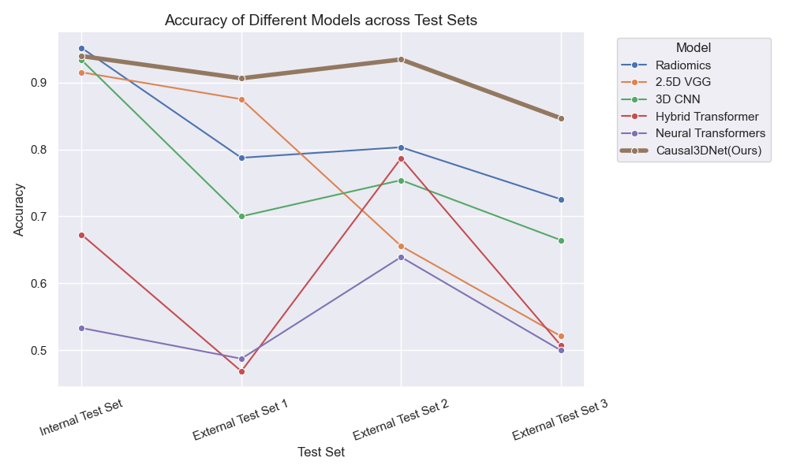

# Causal3D-Net: A Stable Model for Pancreatic Cancer Diagnosis via Multi-Center Small-Sample Contrast-Enhanced CT

<p align="center">
  <a href="README.md">English</a> |
  <a href="README_cn.md">中文</a>
</p>

<p align="center">
  
  
  
  
  
  
</p>
This is the official repository of Causal3DNet, a specialized deep learning model designed for pancreatic cancer diagnosis.

The model, grounded in causal learning theory, learns the key diagnostic cues used by expert radiologists as causal features.

## Display of Model Metrics

### Comparison with state-of-the-art methods



#### Internal Test Set

|        Method        | Accuracy |  AUC   | Sensitivity | Specificity | Precision |   F1   |
| :------------------: | :------: | :----: | :---------: | :---------: | :-------: | :----: |
|      Radiomics       |  0.9515  | 0.9966 |   0.9247    |   0.9861    |  0.9885   | 0.9556 |
|       2.5D VGG       |  0.9152  | 0.9757 |   0.9140    |   0.9167    |  0.9341   | 0.9239 |
|         ViT          |  0.4364  | 0.5000 |   0.0000    |   1.0000    |  0.0000   | 0.0000 |
|        3D CNN        |  0.9333  | 0.9803 |   0.9570    |   0.9028    |  0.9271   | 0.9418 |
| Hybrid  Transformer  |  0.6727  | 0.7446 |   0.5161    |   0.8750    |  0.8421   | 0.6400 |
|        C Net         |  0.4364  | 0.5000 |   0.0000    |   1.0000    |  0.0000   | 0.0000 |
| Neural  Transformers |  0.5333  | 0.6095 |   0.4194    |   0.6806    |   0.629   | 0.5032 |
|  Causal3DNet(Ours)   |  0.9394  | 0.9714 |   0.9355    |   0.9444    |  0.9560   | 0.9457 |

#### External Test Set 1

|        Method        | Accuracy |  AUC   | Sensitivity | Specificity | Precision |   F1   |
| :------------------: | :------: | :----: | :---------: | :---------: | :-------: | :----: |
|      Radiomics       |  0.7875  | 0.8701 |   0.8625    |   0.7125    |  0.7500   | 0.8023 |
|       2.5D VGG       |  0.8750  | 0.9440 |   0.8750    |   0.8750    |  0.8750   | 0.8750 |
|         ViT          |  0.5000  | 0.5000 |   0.0000    |   1.0000    |  0.0000   | 0.0000 |
|        3D CNN        |  0.7000  | 0.7778 |   0.6750    |   0.7250    |  0.7105   | 0.6923 |
| Hybrid  Transformer  |  0.4688  | 0.4292 |   0.6000    |   0.3375    |  0.4752   | 0.5304 |
|        C Net         |  0.5000  | 0.5000 |   0.0000    |   1.0000    |  0.0000   | 0.0000 |
| Neural  Transformers |  0.4875  | 0.4305 |   0.6125    |   0.3625    |  0.4900   | 0.5444 |
|  Causal3DNet(Ours)   |  0.9062  | 0.9605 |   0.8375    |   0.9750    |  0.9710   | 0.8993 |

#### External Test Set 2

|        Method        | Accuracy | AUC  | Sensitivity | Specificity | Precision |  F1  |
| :------------------: | :------: | :--: | :---------: | :---------: | :-------: | :--: |
|      Radiomics       |  0.8033  |  -   |      -      |   0.8033    |     -     |  -   |
|       2.5D VGG       |  0.6557  |  -   |      -      |   0.6557    |     -     |  -   |
|         ViT          |  1.0000  |  -   |      -      |   1.0000    |     -     |  -   |
|        3D CNN        |  0.7541  |  -   |      -      |   0.7541    |     -     |  -   |
| Hybrid  Transformer  |  0.7869  |  -   |      -      |   0.7869    |     -     |  -   |
|        C Net         |  1.0000  |  -   |      -      |   1.0000    |     -     |  -   |
| Neural  Transformers |  0.6393  |  -   |      -      |   0.6393    |     -     |  -   |
|  Causal3DNet(Ours)   |  0.9344  |  -   |      -      |   0.9344    |     -     |  -   |

#### External Test Set 3

|        Method        | Accuracy | AUC  | Sensitivity | Specificity | Precision |  F1  |
| :------------------: | :------: | :--: | :---------: | :---------: | :-------: | :--: |
|      Radiomics       |  0.7257  |  -   |      -      |   0.7257    |     -     |  -   |
|       2.5D VGG       |  0.5212  |  -   |      -      |   0.5212    |     -     |  -   |
|         ViT          |  1.0000  |  -   |      -      |   1.0000    |     -     |  -   |
|        3D CNN        |  0.6646  |  -   |      -      |   0.6646    |     -     |  -   |
| Hybrid  Transformer  |  0.5075  |  -   |      -      |   0.5075    |     -     |  -   |
|        C Net         |  1.0000  |  -   |      -      |   1.0000    |     -     |  -   |
| Neural  Transformers |  0.500   |  -   |      -      |    0.500    |     -     |  -   |
|  Causal3DNet(Ours)   |  0.8466  |  -   |      -      |   0.8466    |     -     |  -   |

## Install

```linux
conda env create -f environment.yaml
```

## Preprocessing

### crop data

```linux
/home/huangdn/anaconda/envs/Causal3DNet/bin/python -m src.preprocessing.ROI_data \
	--input /home/huangdn/Causal3D-Net/src/dataset/dataset.xlsx \
	--outdir /home/huangdn/Causal3D-Net/src/dataset \
	--process_num 6
```

### extract radiomics features

```linux
/home/huangdn/anaconda/envs/Causal3DNet/bin/python -m src.preprocessing.extract_radiomics \
	--input /home/huangdn/Causal3D-Net/src/dataset/dataset_for_radiomics_read.xlsx \
	--output /home/huangdn/Causal3D-Net/src/dataset/radiomics_features.xlsx \
	--process_num 4
```

## Training

### segmentation training

```linux
python -m src.training.train_Causal3DNet \
  --train <train_dataset_path> \
  --test <test_dataset_path> \
  [--cuda <gpu_id>] \
  [--outdir <output_dir>]
```

### classification training

```linux
python -m src.training.train_Causal3DNet \
  --train <train_excel_path> \
  --test <test_excel_path> \
  [--indi {0,1}] \
  [--cent {0,1}] \
  [--orth {0,1}] \
  --cuda <gpu_id> \
  --outdir <output_dir> \
  --weight <segmentation_model_path>
```

## Ablation

### Using orthogonal constraints

#### main branch only

```sh
/home/huangdn/anaconda/envs/Causal3DNet/bin/python -m src.training.train_Causal3DNet \
    --train /home/huangdn/Causal3D-Net/src/dataset/dataset_for_train.xlsx \
    --test /home/huangdn/Causal3D-Net/src/dataset/dataset_for_test.xlsx \
    --indi 0 \
    --cent 0 \
    --cuda 5 \
    --outdir /home/huangdn/Causal3D-Net/src/results \
    --weight /home/huangdn/Causal3D-Net/src/results/2025-06-21_06-49-30/last_model.pth
```

#### main branch and individual branch

```sh
/home/huangdn/anaconda/envs/Causal3DNet/bin/python -m src.training.train_Causal3DNet \
    --train /home/huangdn/Causal3D-Net/src/dataset/dataset_for_train.xlsx \
    --test /home/huangdn/Causal3D-Net/src/dataset/dataset_for_test.xlsx \
    --indi 1 \
    --cent 0 \
    --cuda 5 \
    --outdir /home/huangdn/Causal3D-Net/src/results \
    --weight /home/huangdn/Causal3D-Net/src/results/2025-06-21_06-49-30/last_model.pth
```

#### main branch and center branch

```sh
/home/huangdn/anaconda/envs/Causal3DNet/bin/python -m src.training.train_Causal3DNet \
    --train /home/huangdn/Causal3D-Net/src/dataset/dataset_for_train.xlsx \
    --test /home/huangdn/Causal3D-Net/src/dataset/dataset_for_test.xlsx \
    --indi 0 \
    --cent 1 \
    --cuda 5 \
    --outdir /home/huangdn/Causal3D-Net/src/results \
    --weight /home/huangdn/Causal3D-Net/src/results/2025-06-21_06-49-30/last_model.pth
```

### Without using orthogonal constraints

#### main branch only

```sh
/home/huangdn/anaconda/envs/Causal3DNet/bin/python -m src.training.train_Causal3DNet \
    --train /home/huangdn/Causal3D-Net/src/dataset/dataset_for_train.xlsx \
    --test /home/huangdn/Causal3D-Net/src/dataset/dataset_for_test.xlsx \
    --indi 0 \
    --cent 0 \
    --orth 0 \
    --cuda 5 \
    --outdir /home/huangdn/Causal3D-Net/src/results \
    --weight /home/huangdn/Causal3D-Net/src/results/2025-06-21_06-49-30/last_model.pth
```

#### main branch and individual branch

```sh
/home/huangdn/anaconda/envs/Causal3DNet/bin/python -m src.training.train_Causal3DNet \
    --train /home/huangdn/Causal3D-Net/src/dataset/dataset_for_train.xlsx \
    --test /home/huangdn/Causal3D-Net/src/dataset/dataset_for_test.xlsx \
    --indi 1 \
    --cent 0 \
    --orth 0 \
    --cuda 5 \
    --outdir /home/huangdn/Causal3D-Net/src/results \
    --weight /home/huangdn/Causal3D-Net/src/results/2025-06-21_06-49-30/last_model.pth
```

#### main branch and center branch

```sh
/home/huangdn/anaconda/envs/Causal3DNet/bin/python -m src.training.train_Causal3DNet \
    --train /home/huangdn/Causal3D-Net/src/dataset/dataset_for_train.xlsx \
    --test /home/huangdn/Causal3D-Net/src/dataset/dataset_for_test.xlsx \
    --indi 0 \
    --cent 1 \
    --orth 0 \
    --cuda 5 \
    --outdir /home/huangdn/Causal3D-Net/src/results \
    --weight /home/huangdn/Causal3D-Net/src/results/2025-06-21_06-49-30/last_model.pth
```

#### three branch

```sh
/home/huangdn/anaconda/envs/Causal3DNet/bin/python -m src.training.train_Causal3DNet \
    --train /home/huangdn/Causal3D-Net/src/dataset/dataset_for_train.xlsx \
    --test /home/huangdn/Causal3D-Net/src/dataset/dataset_for_test.xlsx \
    --indi 1 \
    --cent 1 \
    --orth 0 \
    --cuda 5 \
    --outdir /home/huangdn/Causal3D-Net/src/results \
    --weight /home/huangdn/Causal3D-Net/src/results/2025-06-21_06-49-30/last_model.pth
```

## Baseline

```
/home/huangdn/anaconda/envs/Causal3DNet/bin/python -m src.baselines.baseline_entry \
    --train /home/huangdn/Causal3D-Net/src/dataset/dataset_for_train.xlsx \
    --test /home/huangdn/Causal3D-Net/src/dataset/dataset_for_test.xlsx \
    --method 2.5d_vgg \
    --cuda_id 5 \
    --outdir /home/huangdn/Causal3D-Net/src/results
```

## 🤝 Collaborating Institutions

<p align="center">
  <a href="http://www.wuxihospital.com">
    
  </a>
  &nbsp;&nbsp;&nbsp;
  <a href="https://www.wx2h.com">
    
  </a>
  &nbsp;&nbsp;&nbsp;
  <a href="https://www.yzsbh.com">
    
  </a>
  &nbsp;&nbsp;&nbsp;
  <a href="https://www.zjhospital.net">
    
  </a>
  &nbsp;&nbsp;&nbsp;
  <a href="https://www.zs-hospital.sh.cn/zhuanye/">
    
  </a>
</p>
