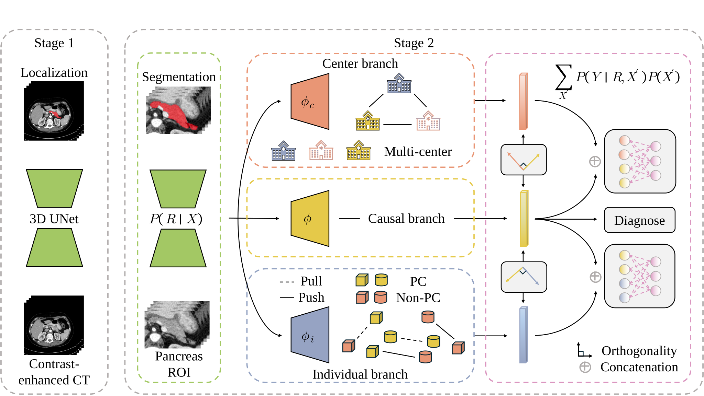

# Causal3D-Net: A causal model for multi-center small-sample pancreatic cancer diagnosis using contrast-enhanced CT

<p align="center">
  <a href="README.md">English</a> |
  <a href="README_cn.md">中文</a>
</p>

<p align="center">
  
  
  
  
  
  
</p>
This is the official repository of Causal3DNet — a dedicated model for pancreatic cancer diagnosis.

The model is based on causal learning theory, enabling it to distinguish between causal factors and confounders. By ultimately leveraging reliable causal features as diagnostic evidence, the model achieves stable learning and diagnosis.

The figure below illustrates the model architecture proposed in the paper:



## ⚙️ Install

```linux
conda env create -f environment.yaml
```

## 🚀 Usage

All experiments can be launched with the following command:

```
python -m src.training.main <mode> [options]
```

### Segmentation Training

```
python -m src.training.main seg \
    --train /path/to/dataset_for_train.xlsx \
    --test /path/to/dataset_for_test.xlsx \
    --cuda 0 \
    --outdir ./results/segmentation
```

Arguments:

- –train : Path to the training dataset (Excel file).
- –test : Path to the testing dataset (Excel file).
- –cuda : GPU index to use (default: 0).
- –outdir : Directory to save results (default: ./results).

### Causal3DNet Training

```
python -m src.training.main causal \
    --train /path/to/dataset_for_train.xlsx \
    --test /path/to/dataset_for_test.xlsx \
    --indi 1 \
    --cent 1 \
    --orth 1 \
    --cuda 0 \
    --outdir ./results/causal3dnet \
    --weight ./pretrained/best_model.pth
```

**Arguments:**

- –train : Path to the training dataset (Excel file).
- –test : Path to the testing dataset (Excel file).
- –indi : Whether to use the individual branch (default: enabled).
- –cent : Whether to use the center branch (default: enabled).
- –orth : Whether to use orthogonal constraint (default: enabled).
- –cuda : GPU index to use (default: 0).
- –outdir : Directory to save results (default: ./results).
- –weight : Path to the pretrained segmentation weight file (default: ./best_model.pth).

## 📝 Notes

- Use **-m** to run modules so that Python correctly resolves package imports.
- Make sure your dataset is prepared in **Excel format** (.xlsx), containing proper training and testing splits.
- GPU index (–cuda) should be set according to your hardware.

### Example of Dataset Excel File

| **image_path**               | **mask_path**                 | **cancer** | **center** | **cluster** |
| ---------------------------- | ----------------------------- | ---------- | ---------- | ----------- |
| Center01Img00002_private.npy | Center01Mask00002_private.npy | 1          | 0          | 0           |
| Center01Img00003_private.npy | Center01Mask00003_private.npy | 1          | 0          | 0           |
| …                            | …                             | …          | …          | …           |

## 📖 Citation

If you find this repository helpful in your research, please consider citing our work:

```
@article{huang2025causal3dnet,
  title   = {Causal3D-Net: A Causal Model for Multi-center Small-sample Pancreatic Cancer Diagnosis Using Contrast-enhanced CT},
  author  = {Denan, Huang and Others},
  journal = {mabye TIP, TMI or MIA},
  year    = {2025 or 2026},
  volume  = {XX},
  pages   = {XX--XX},
  doi     = {10.XXXX/j.media.2025.XXXXX}
}
```

## 🤝 Collaborating Institutions

<p align="center">
  <a href="http://www.wuxihospital.com">
    
  </a>
  &nbsp;&nbsp;&nbsp;
  <a href="https://www.wx2h.com">
    
  </a>
  &nbsp;&nbsp;&nbsp;
  <a href="https://www.yzsbh.com">
    
  </a>
  &nbsp;&nbsp;&nbsp;
  <a href="https://www.zjhospital.net">
    
  </a>
  &nbsp;&nbsp;&nbsp;
  <a href="https://www.zs-hospital.sh.cn/zhuanye/">
    
  </a>
</p>
